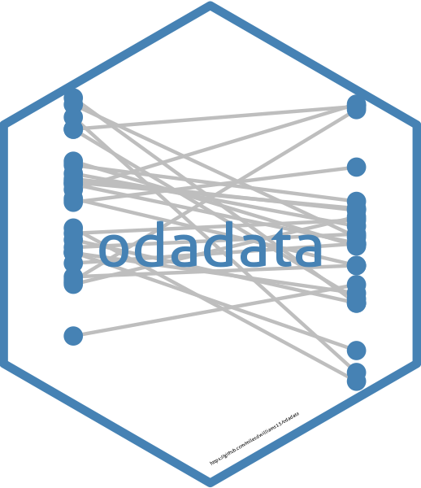

# {odadata} 

     [](https://orcid.org/0000-0003-0192-5542)

An R package for adding dyadic and country-level ODA data to {peacesciencer} constructed datasets.

------------------------------------------------------------------------

To install the latest development version of the package:

```         
library(devtools)
devtools::install_github("milesdwilliams15/odadata")
```

The workhorse function of `{odadata}` is `add_oda()`. It is meant to work in conjunction with the [`{peacesciencer}`](https://github.com/svmiller/peacesciencer/tree/master) R package. The function will populate either a dyad-year or state-year dataset with bilateral ODA commitments and disbursements from the [OECD's API](https://www.oecd.org/en/data/insights/data-explainers/2024/09/api.html). Values are in millions of 2023 US Dollars.

To use the function, you must first create a country dyad-year or state-year dataset using a `{peacesciencer}` `create_*()` function. Then you can use `add_oda()` to populate your data with ODA values.

To get started, you should open the `{tidyverse}` (recommended) and `{peacesciencer}`, along with `{odadata}`.

```         
library(tidyverse)
library(peacesciencer)
library(odadata)
```

Then you can start making datasets. For example, the below code will make a dyad-year dataset where ODA commitments and disbursements from country 1 to country 2 are added as new columns.

```         
create_dyadyears(subset_years = 1960:2023) |>
  add_oda() -> dt
```

You can make a state-year dataset of total bilateral ODA commitments and disbursements as well.

```         
create_stateyears(subset_years = 1960:2023) |>
  add_oda() -> dt
```

By default, `add_oda()` adds ODA giving by donor when populating a state-year level dataset. If you want it to provide ODA received instead, simply set `type = "recipient"`.

```         
create_stateyears(subset_years = 1960:2023) |>
  add_oda(type = "recipient") -> dt
```

By default, the full set of dyad-years or state-years generated by `create_*()` will be returned. You may not, however, be interested in every single case, but instead only the universe of relevant ODA donors and/or recipients as captured by the OECD. You can use the function `filter_rdr()` to whittle the data down to only relevant donors and/or recipients. For example:

```         
create_dyadyears(subset_years = 1960:2023) |>
  add_oda() |>
  filter_rdr() -> dt
```

The data is filtered by valid ODA commitments by default, which only have valid entries from 1966 to 2023. If you would prefer to filter by ODA disbursements, which run from 1960 to 2023, you can specify `by = "disbursements"` in `filter_rdr()` instead.
